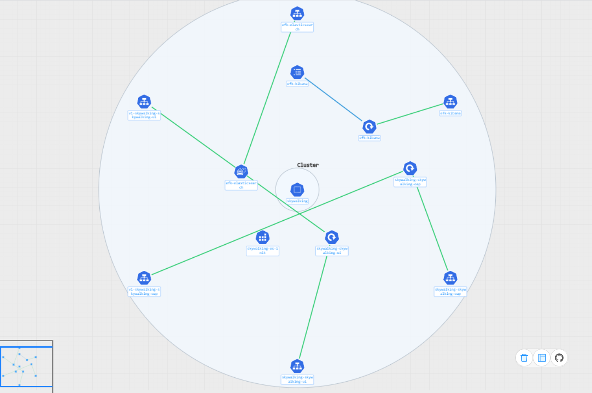
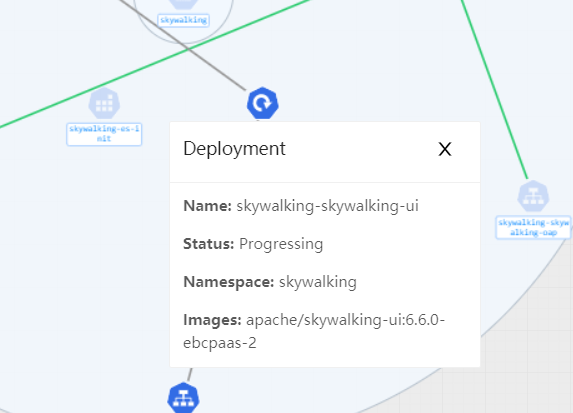
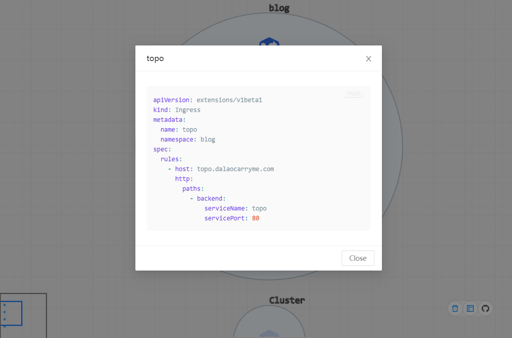

[](https://www.codacy.com/manual/Okabe-Kurisu/kube-topo?utm_source=github.com&utm_medium=referral&utm_content=Okabe-Kurisu/kube-topo&utm_campaign=Badge_Grade)


# Kube-Topo

一个用来将 Yaml 文件中的拓扑关系可视化的工具。欢迎各位提 Issue、PR 来帮助这个工具发展的更好。

**线上 Demo**

> http://topo.dalaocarryme.com

## 使用方法

获取[最新版本]()的代码，进入到根目录下运行以下代码来安装依赖并启动应用

```sh
yarn
yarn start # 默认启动在3000端口
```

拖动 yaml 文件到应用首页中，并等待处理。可以同时或陆续拖动多个 yaml 到应用中，他们会被视为同一个实例中的资源。作为样例，可以下载[这个文件](https://raw.githubusercontent.com/Okabe-Kurisu/kube-topo/master/deployment.yaml)并拖入到页面中查看效果。

## 样例





## 功能

### 资源关系分析

可以分析资源之间的关系，并通过线条进行联系。其中蓝色的线代表是依赖关系，绿色的线代表暴露了某个服务。

### 简要信息面板

将鼠标放置在某个资源的图标上，可以看到关于该资源的一些简单信息。

### 调度分析(非常不完善)

将 node 的 yaml 信息和其他资源的 yaml 信息都导入后可以通过简要信息面板查看工作负载预期的调度情况。

### yaml 查看

右键点击资源，在弹出的菜单中点击`View Yaml`可以看到该资源的 yaml 文件

### 清空资源

点击右下角工具栏中的垃圾桶图标，可以清空当前上下文中的资源。

## License

搞不懂欸，想用 WTF 但是又怕有奇怪的问题。保险起见先用个[MIT](./LICENSE)，这代码爱咋咋地吧。
